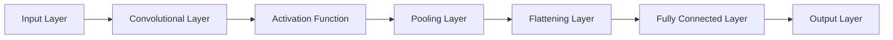
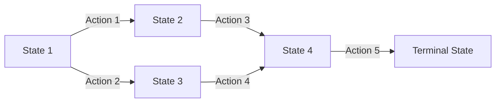
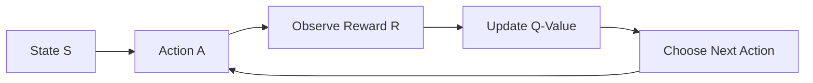
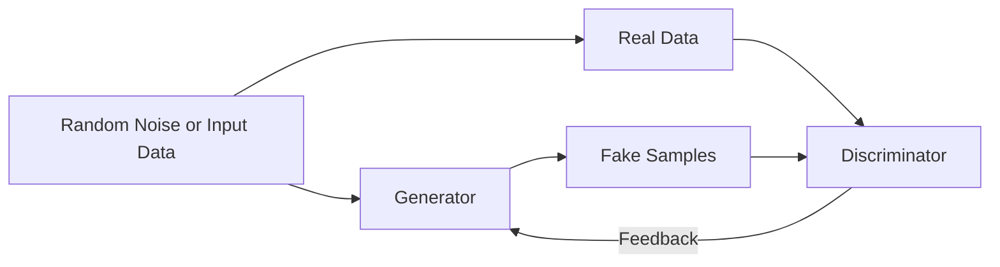
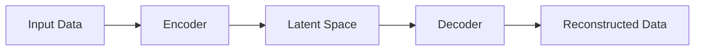
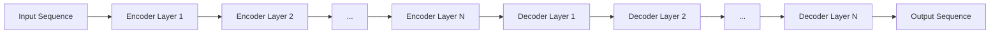

**Model** is a simplified version of a real world entity that focuses on some of the properties of the real object that are under study. Similar to the models doing a ramp walk, help us understand how the clothes developed by a designer might look, models are an integral part of software industry, that help in catering to a specific set of properties that we want to create in the soft world.

In artificial intelligence, a model is a mathematical representation of a specific aspect of the real world. AI models are created using algorithms and data to learn patterns, make predictions, or perform tasks without being explicitly programmed for each step. These models serve as the core components of AI systems and are used to process information, make decisions, and generate outputs based on input data.

AI models can take various forms depending on the type of problem they are designed to solve. Some common types of AI models include:

**Machine Learning Models**: These models learn from data to make predictions or decisions without being explicitly programmed. They include algorithms like linear regression, decision trees, support vector machines, neural networks, and more.

**Deep Learning Models**: A subset of machine learning, deep learning models use neural networks with multiple layers to learn complex patterns in data. They are commonly used for tasks like image recognition, natural language processing, and speech recognition.

**Reinforcement Learning Models**: These models learn through trial and error by interacting with an environment and receiving feedback in the form of rewards or penalties. They are used in applications like game playing, robotics, and autonomous systems.

**Generative Models**: Generative models create new data or content based on patterns learned from existing data. They are used for tasks like image generation, text generation, and content creation.

<picture>
     
   

</picture>
## Machine Learning Models
Machine learning models are designed to learn from data and make predictions or decisions without being explicitly programmed for every scenario. Here's a brief overview of some common machine learning algorithms mentioned:

**Linear Regression**:

Linear regression is a foundational machine learning technique that predicts a continuous value based on input features by fitting a linear relationship between them.  
By assuming a linear relationship between the independent variables and the output, linear regression calculates predictions by assigning weights to each feature and adding an intercept term. 
This model is trained to minimize the difference between predicted and actual values, making it a valuable tool for tasks like sales forecasting, price estimation, and trend analysis across various industries. 
The interpretability of linear regression coefficients allows for a clear understanding of how each input feature influences the predicted output, making it a widely used and versatile method in data analysis and prediction.

**Decision Trees**:

Decision Trees are tree-like models used in machine learning where each internal node represents a decision based on an input feature.

These models are versatile and can be used for both classification and regression tasks. In a Decision Tree, the data is split at each node based on feature values to create branches that lead to leaf nodes representing the final decision or prediction. 

Decision Trees are easy to interpret and visualize, making them popular for understanding the decision-making process in a transparent manner. 

They are effective for tasks like classification, where the goal is to predict the class label of a sample, and regression, where the goal is to predict a continuous value.

**Support Vector Machines (SVM)**:

Support Vector Machines (SVM) are powerful machine learning models that are effective for both classification and regression tasks. SVM works by finding the hyperplane that best separates classes in the feature space.

In classification tasks, SVM aims to find the optimal hyperplane that maximizes the margin between different classes, leading to better generalization and robustness. SVM can handle linear and non-linear relationships through the use of kernel functions, allowing it to capture complex decision boundaries in high-dimensional spaces.

SVM is widely used in various domains for tasks like image classification, text categorization, and anomaly detection due to its ability to find the best separation between classes in the feature space.

## Deep Learning Models

Deep learning is a part of machine learning that uses neural networks with many layers to understand complex patterns in data. By copying how the human brain works, deep learning models can automatically find and show complicated connections in large amounts of data. These models are very good at tasks like recognizing images, understanding language, recognizing speech, and more, where normal machine learning methods might not work as well.

Deep learning techniques, like Convolutional Neural Networks (CNNs) for looking at images and Recurrent Neural Networks (RNNs) for working with data in a sequence, have changed fields like computer vision, healthcare, finance, and self-operating systems. The power of deep learning models to find important features in data and make correct predictions has pushed forward progress in artificial intelligence, letting machines do tasks with intelligence and efficiency similar to humans.

**Convolutional Neural Networks (CNNs)**
Convolutional Neural Networks (CNNs) are a type of deep learning model commonly used for tasks like image recognition, object detection, and image classification.

CNNs are designed to automatically learn and extract hierarchical features from images by applying convolutional layers that capture patterns like edges, textures, and shapes. 

These models are effective in handling spatial relationships in images and have revolutionized computer vision tasks by enabling accurate and efficient analysis of visual data. CNNs have become a cornerstone in various applications such as facial recognition, medical image analysis, autonomous driving, and more, showcasing their versatility and effectiveness in processing visual information.

An example of layers in CNN

**Recurrent Neural Networks (RNNs)**
Recurrent Neural Networks (RNNs) are a type of neural network designed to handle sequential data, where the order of data points matters. RNNs have loops within their architecture, allowing them to maintain a memory of previous inputs as they process new ones. This memory feature enables RNNs to capture dependencies and patterns over time, making them suitable for tasks like language modeling, speech recognition, time series prediction, and more. The ability of RNNs to work with sequential data has made them popular in natural language processing and other applications where context and temporal information are crucial for making accurate predictions.

## Reinforcement Learning Models

Reinforcement learning models are machine learning algorithms that learn by interacting with an environment, receiving feedback in the form of rewards and penalties based on their actions. These algorithms aim to maximize cumulative rewards over time by making decisions through trial and error. Some key processes and algorithms in reinforcement learning include:

**Markov Decision Processes (MDPs)**

Markov Decision Processes (MDPs) offer a mathematical framework for modeling decision-making in scenarios where outcomes are influenced by both random events and the decisions made by an agent. MDPs consist of:

*States*: Represent the different situations or conditions in which the agent can find itself.  
*Actions*: Choices available to the agent at each state.  
*Transition Probabilities*: Define the likelihood of moving from one state to another based on the chosen action.  
*Rewards*: Quantify the immediate benefit or cost associated with transitioning between states.  

**Q-learning**

Q-learning is a model-free reinforcement learning algorithm that aims to learn the optimal action-selection policy for a given Markov Decision Process (MDP). It works by estimating the value of taking a specific action in a particular state, known as the Q-value. The algorithm iteratively updates these Q-values based on the rewards received from the environment. By exploring different actions and updating Q-values accordingly, Q-learning enables the agent to learn the best policy for maximizing cumulative rewards over time in a dynamic environment. This approach allows the agent to make informed decisions based on the learned Q-values, leading to efficient and effective decision-making in complex scenarios.

## Generative Models

Generative models are a class of machine learning models that aim to create new data or content based on patterns learned from existing data. These models learn the underlying structure of the data and generate new samples that resemble the original data distribution. Generative models are widely used in tasks like image generation, text generation, and content creation.

**Generative Adversarial Networks (GANs)**

Generative Adversarial Networks (GANs) are a class of generative models that comprise two neural networks: a generator and a discriminator. These networks are trained in an adversarial manner, where they compete against each other in a game-like setting.

*Generator*: The generator network generates fake samples, such as images or videos, based on random noise or input data. Its goal is to create samples that are indistinguishable from real data.

*Discriminator*: The discriminator network acts as a critic and tries to differentiate between real samples from the dataset and fake samples produced by the generator. Its objective is to correctly classify whether a given sample is real or fake.

Through this adversarial training process, the generator learns to create increasingly realistic samples to fool the discriminator, while the discriminator improves its ability to distinguish between real and fake data. This competition between the two networks leads to the refinement of both models, ultimately resulting in the generation of high-quality and realistic data, such as images and videos, by the generator. GANs have demonstrated remarkable success in various applications, including image generation, style transfer, and data augmentation.

**Variational Autoencoders (VAEs)**

Variational Autoencoders (VAEs) are a type of generative model that focuses on learning a low-dimensional latent space representation of data. VAEs consist of an encoder network that maps input data to a latent space and a decoder network that reconstructs the input data from the latent space representation.

*Encoder:* The encoder network takes input data and maps it to a lower-dimensional latent space, where each point represents a different configuration of the input data. This latent space captures the underlying structure of the data in a compressed form.

*Decoder:* The decoder network takes a point from the latent space and reconstructs the input data. By sampling from the learned latent space, VAEs can generate new samples that resemble the original data distribution.

VAEs are trained to reconstruct input data accurately while also regularizing the latent space to follow a specific distribution, typically a Gaussian distribution. This regularization encourages the latent space to be continuous and smooth, allowing for meaningful interpolation between data points.

By learning a compact and structured latent space representation, VAEs can generate new samples by sampling from this space. They are commonly used for tasks like image generation, data compression, and representation learning, where capturing the underlying structure of the data is essential for generating meaningful outputs.

**Transformers**

Transformers are a class of deep learning models that have gained significant popularity, particularly in natural language processing tasks. Transformers have revolutionized the field by addressing the limitations of recurrent neural networks (RNNs) and long short-term memory (LSTM) networks in capturing long-range dependencies in sequential data.

Key features of Transformers include:

*Self-Attention Mechanism:* Transformers leverage self-attention mechanisms to weigh the importance of different input tokens when processing each token. This mechanism allows the model to capture dependencies between distant words in a sentence efficiently.

*Transformer Architecture:* Transformers consist of an encoder-decoder architecture, where the encoder processes the input sequence and the decoder generates the output sequence. Each layer in the encoder and decoder contains multi-head self-attention mechanisms and feedforward neural networks.

*Positional Encoding:* To maintain the sequential order of input tokens, Transformers use positional encodings to inject information about the position of tokens into the model.

Transformers have been successfully applied to various natural language processing tasks, including machine translation, text summarization, language modeling, and more. Additionally, Transformers have been adapted beyond text-based tasks and applied to image captioning, speech recognition, and other sequential data tasks due to their ability to capture complex dependencies efficiently.

