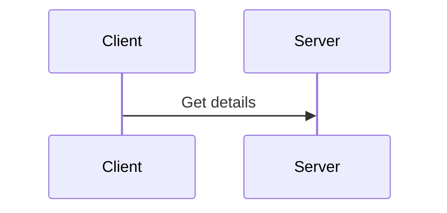
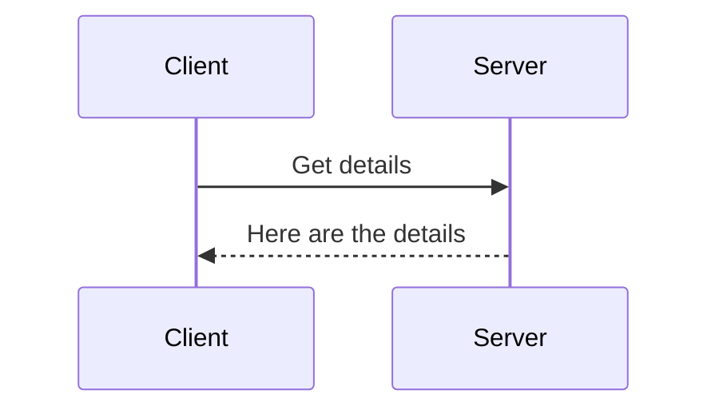
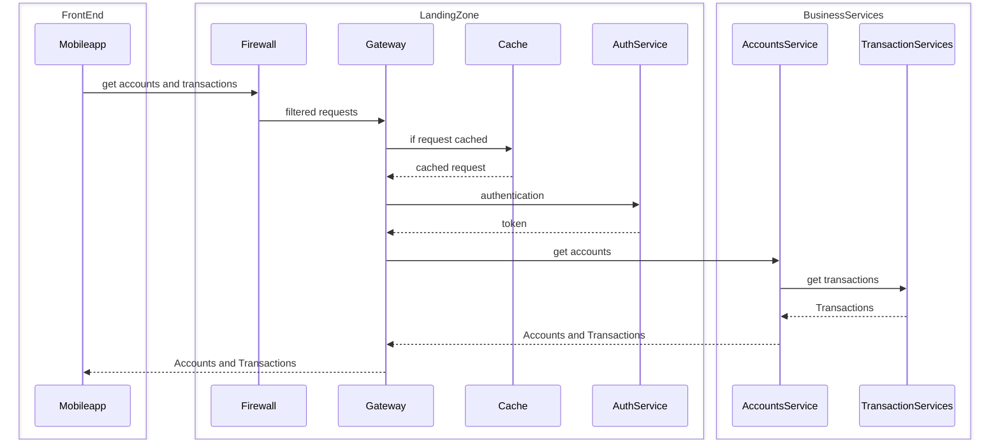
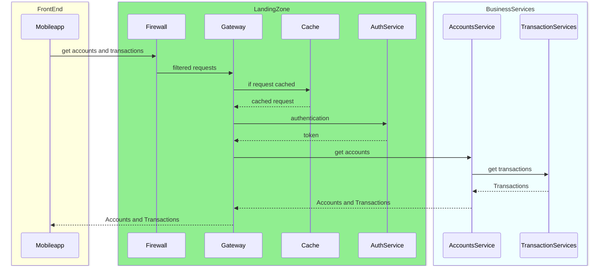
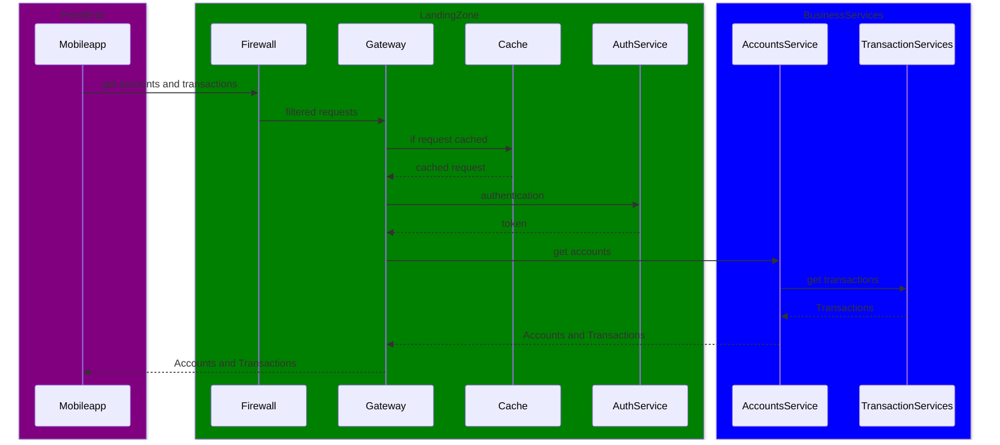
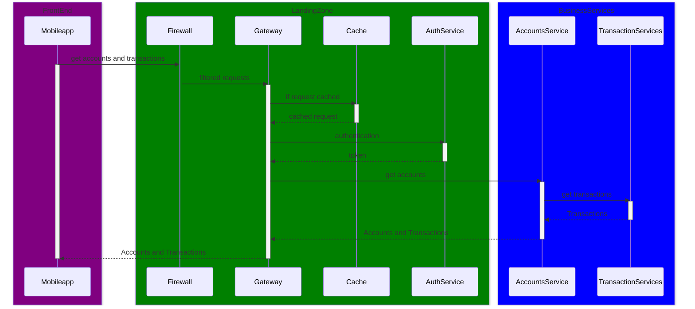
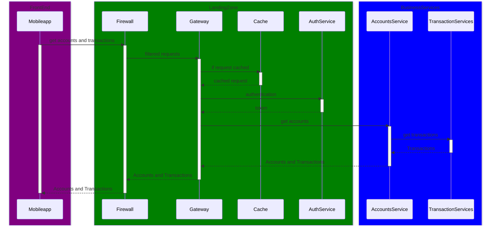
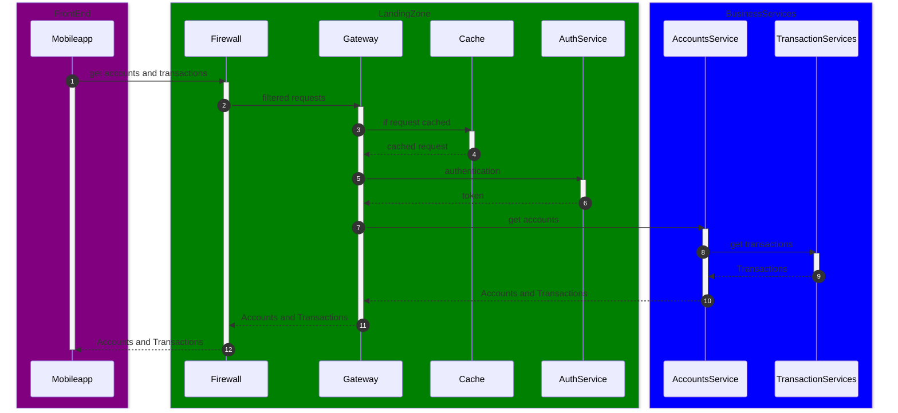
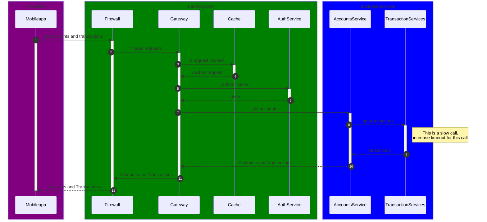

I have been creating designs for software solutions for quite some time now. A picture is worth a thousand words and hence the different diagrams really help in expressing the software designs in a better way to fellow team mates.

A Sequence diagram is a powerful tool that shows the step-by-step interactions between different parts of a software system, making it easier to understand how messages and actions flow.

Over the years, I've utilized various tools like Visio and Draw.io for manual diagram creation. However, in recent times, I've found mermaid.js to be my preferred tool for crafting sequence diagrams. Mermaid.js stands out as it enables diagram creation using a specific DSL, primarily in markdown format. This markdown is swiftly transformed into shareable diagrams.

Mermaid's user-friendly markdown format makes it easy to grasp, leading to a shorter learning curve. Additionally, markdown files can be stored in git for version control, enhancing collaboration.

The integration of different IDE plugins facilitates rapid editing, thereby enhancing efficiency and speeding up the delivery process.

Today I will explain how can we create the sequence diagram using mermaid

* Participants
* Request and Response representations
* Grouping Participants
* Auto numbering
* Notes
* Activations

## Participants
Participants represent the entities or components involved in the sequence of interactions. They are typically depicted as boxes at the top of the diagram. Here's an example:
```txt
sequenceDiagram
    Client->>Server: Get details
```


In the above diagram, we have two participants Client and Server.
The Client is requesting to "Get details" from the server.
While it is optional, but I prefer to call out the participants on the top of the diagram, to be more specific.
It also aids in improving the thought process by calling out all the participants upfront. e.g.
```txt
sequenceDiagram
    participant Client
    participant Server
    Client->>Server: Get details
```

## Request and Response representations
In the previous example we determined that the arrow ``` ->>``` represents the request.
While it is not a standard representation, I like to represent the responses with a dashed arrow. The dashed arrow can be represente by ``` -->>```.
```txt
sequenceDiagram
    participant Client
    participant Server
    Client->>Server: Get details
    Server -->> Client: Here are the details
```

## Grouping Participants
Sometimes we want to represent more components in a complex system, involving multiple participants. It is easier to group the participants for easier understanding.
Let's group the participants using a box

```text
sequenceDiagram
box FrontEnd
    participant Mobileapp
end
box LandingZone
    participant Firewall
    participant Gateway
    participant Cache
    participant AuthService
end
box BusinessServices
    participant AccountsService
    participant TransactionServices
end
Mobileapp ->> Firewall : get accounts and transactions
Firewall ->> Gateway : filtered requests
Gateway ->> Cache : if request cached
Cache -->> Gateway : cached request
Gateway ->> AuthService: authentication
AuthService -->> Gateway : token
Gateway ->>AccountsService : get accounts
AccountsService ->> TransactionServices : get transactions
TransactionServices -->> AccountsService : Transactions
AccountsService -->> Gateway : Accounts and Transactions
Gateway -->> Mobileapp : Accounts and Transactions
```


Although we have grouped the participants, it is still not very clear. Let's add some colours to represent the diagrams better : 

```text
sequenceDiagram
box lightyellow FrontEnd
    participant Mobileapp
end
box lightgreen LandingZone
    participant Firewall
    participant Gateway
    participant Cache
    participant AuthService
end
box azure BusinessServices
    participant AccountsService
    participant TransactionServices
end
Mobileapp ->> Firewall : get accounts and transactions
Firewall ->> Gateway : filtered requests
Gateway ->> Cache : if request cached
Cache -->> Gateway : cached request
Gateway ->> AuthService: authentication
AuthService -->> Gateway : token
Gateway ->>AccountsService : get accounts
AccountsService ->> TransactionServices : get transactions
TransactionServices -->> AccountsService : Transactions
AccountsService -->> Gateway : Accounts and Transactions
Gateway -->> Mobileapp : Accounts and Transactions
```


The above colours work well for light mode, for dark mode let's chose darker colours : 
```text
sequenceDiagram
box purple FrontEnd
    participant WebApp
    participant Mobileapp
    participant PartnerApp
end
box green LandingZone
    participant Firewall
    participant Gateway
    participant Cache
    participant AuthService
end
box blue BusinessServices
    participant AccountsService
    participant TransactionServices
end
Mobileapp ->> Firewall : get accounts and transactions
Firewall ->> Gateway : filtered requests
Gateway ->> Cache : if request cached
Cache -->> Gateway : cached request
Gateway ->> AuthService: authentication
AuthService -->> Gateway : token
Gateway ->>AccountsService : get accounts
AccountsService ->> TransactionServices : get transactions
TransactionServices -->> AccountsService : Transactions
AccountsService -->> Gateway : Accounts and Transactions
Gateway -->> Mobileapp : Accounts and Transactions
```


## Activations
It would had been great if we could identify for how long each component is active.
Let's activate and deactivate the components to add that detail : 
```text
sequenceDiagram
box purple FrontEnd
    participant Mobileapp
end
box green LandingZone
    participant Firewall
    participant Gateway
    participant Cache
    participant AuthService
end
box blue BusinessServices
    participant AccountsService
    participant TransactionServices
end

Mobileapp ->> Firewall : get accounts and transactions
activate Mobileapp
activate Firewall
Firewall ->> Gateway : filtered requests
activate Gateway
Gateway ->> Cache : if request cached
activate Cache
Cache -->> Gateway : cached request
deactivate Cache
Gateway ->> AuthService: authentication
activate AuthService
AuthService -->> Gateway : token
deactivate AuthService
Gateway ->>AccountsService : get accounts
activate AccountsService
AccountsService ->> TransactionServices : get transactions
activate TransactionServices
TransactionServices -->> AccountsService : Transactions
deactivate TransactionServices
AccountsService -->> Gateway : Accounts and Transactions
deactivate AccountsService
Gateway -->> Mobileapp : Accounts and Transactions
deactivate Gateway
deactivate Mobileapp
```



Oh, the firewall somehow didn't get activated. I just realized that there was a problem in the diagram. Let's correct that :
```text
sequenceDiagram
box purple FrontEnd
    participant Mobileapp
end
box green LandingZone
    participant Firewall
    participant Gateway
    participant Cache
    participant AuthService
end
box blue BusinessServices
    participant AccountsService
    participant TransactionServices
end

Mobileapp ->> Firewall : get accounts and transactions
activate Mobileapp
activate Firewall
Firewall ->> Gateway : filtered requests
activate Gateway
Gateway ->> Cache : if request cached
activate Cache
Cache -->> Gateway : cached request
deactivate Cache
Gateway ->> AuthService: authentication
activate AuthService
AuthService -->> Gateway : token
deactivate AuthService
Gateway ->>AccountsService : get accounts
activate AccountsService
AccountsService ->> TransactionServices : get transactions
activate TransactionServices
TransactionServices -->> AccountsService : Transactions
deactivate TransactionServices
AccountsService -->> Gateway : Accounts and Transactions
deactivate AccountsService
Gateway -->> Firewall : Accounts and Transactions
deactivate Gateway
Firewall -->> Mobileapp : Accounts and Transactions
deactivate Mobileapp
deactivate Firewall
```


## Auto numbering
With the diagram we often need to provide a textual description for the diagram, where we would like to talk about the different invocations.
Let's add numbering to all the calls
```text
sequenceDiagram
autonumber
box purple FrontEnd
    participant Mobileapp
end
box green LandingZone
    participant Firewall
    participant Gateway
    participant Cache
    participant AuthService
end
box blue BusinessServices
    participant AccountsService
    participant TransactionServices
end

Mobileapp ->> Firewall : get accounts and transactions
activate Mobileapp
activate Firewall
Firewall ->> Gateway : filtered requests
activate Gateway
Gateway ->> Cache : if request cached
activate Cache
Cache -->> Gateway : cached request
deactivate Cache
Gateway ->> AuthService: authentication
activate AuthService
AuthService -->> Gateway : token
deactivate AuthService
Gateway ->>AccountsService : get accounts
activate AccountsService
AccountsService ->> TransactionServices : get transactions
activate TransactionServices
TransactionServices -->> AccountsService : Transactions
deactivate TransactionServices
AccountsService -->> Gateway : Accounts and Transactions
deactivate AccountsService
Gateway -->> Firewall : Accounts and Transactions
deactivate Gateway
Firewall -->> Mobileapp : Accounts and Transactions
deactivate Mobileapp
deactivate Firewall
```

## Notes
Sometimes we also need to represent some additional notes in the diagram : 

```text
sequenceDiagram
autonumber
box purple FrontEnd
    participant Mobileapp
end
box green LandingZone
    participant Firewall
    participant Gateway
    participant Cache
    participant AuthService
end
box blue BusinessServices
    participant AccountsService
    participant TransactionServices
end

Mobileapp ->> Firewall : get accounts and transactions
activate Mobileapp
activate Firewall
Firewall ->> Gateway : filtered requests
activate Gateway
Gateway ->> Cache : if request cached
activate Cache
Cache -->> Gateway : cached request
deactivate Cache
Gateway ->> AuthService: authentication
activate AuthService
AuthService -->> Gateway : token
deactivate AuthService
Gateway ->>AccountsService : get accounts
activate AccountsService
AccountsService ->> TransactionServices : get transactions
activate TransactionServices
note right of TransactionServices : This is a slow call, <br> increase timeout for this call
TransactionServices -->> AccountsService : Transactions
deactivate TransactionServices
AccountsService -->> Gateway : Accounts and Transactions
deactivate AccountsService
Gateway -->> Firewall : Accounts and Transactions
deactivate Gateway
Firewall -->> Mobileapp : Accounts and Transactions
deactivate Mobileapp
deactivate Firewall
```



Mermaid offers many more tools for representing the sequence diagram like if-else conditions, loops, breaks etc. 

I feel much more productive while using mermaid over other tools because now I don't waste my time correcting the lines, adjusting the positions of the participants etc.

Although mermaid has it's own limitations e.g. it comes with limited shapes, and colouring and styling options.

 I hope to see more evolutions happening in mermaid js .
 You can read more about Mermaid sequence diagram on the following link : https://mermaid.js.org/syntax/sequenceDiagram.html

