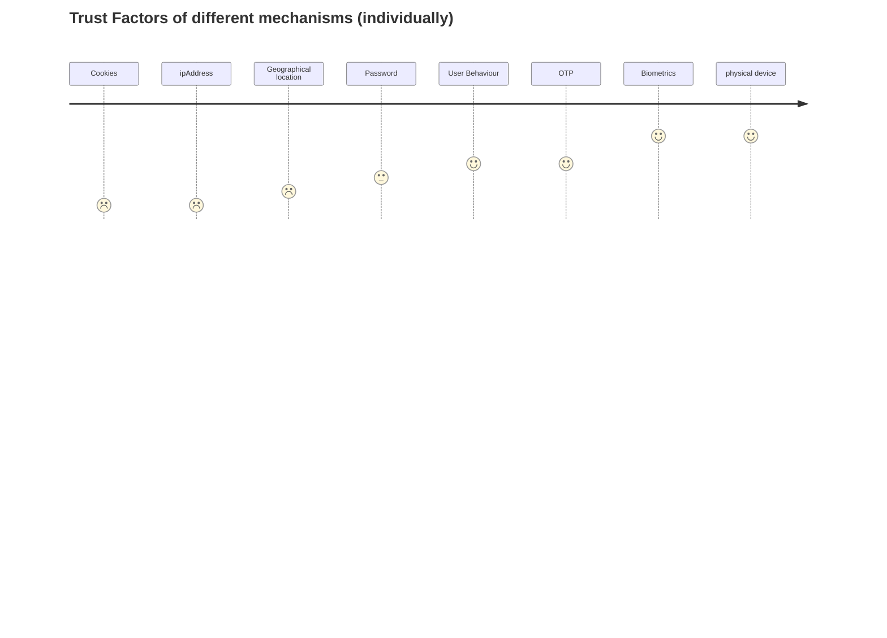

# Motivation behind this blog
During a visit to my friend's house, I needed to check my email on his laptop. Upon entering my credentials, I encountered a captcha prompt unexpectedly. After successfully navigating through the captcha challenge, I was then required to enter an additional layer of OTP. It was only after overcoming both obstacles that I finally gained access to my emails.

On the contrary, I rarely need to input my credentials on my iPad or phone to access Gmail. After logging in once, I can consistently access my emails without the need to reauthenticate my identity each time.

The service's behavior varies depending on the specific circumstances of access. Despite providing a valid password, the trust level of the user is determined by various other factors.

## Adaptive Authentication
Adaptive authentication is a sophisticated security mechanism that mandates users to validate their identity through a diverse range of methods tailored to specific conditions and contexts. This dynamic approach ensures that the authentication process adapts to the unique circumstances of each login attempt, enhancing overall security and mitigating potential risks associated with unauthorized access.

### Passwords as an authentication mechanism
Passwords, while widely used as the default authentication credentials, are known to have inherent security limitations. Numerous articles and discussions have highlighted the vulnerabilities associated with passwords, emphasizing the need for alternative authentication methods. However, due to their widespread acceptance and ease of creation, passwords continue to be the primary authentication mechanism for most websites today. 

To address the risks associated with password leakage, organizations can implement adaptive authentication as a proactive security measure. Adaptive authentication involves analyzing various factors to assess the legitimacy of a user's login attempt. If the login appears suspicious based on predefined criteria, additional verification steps are triggered before granting immediate access. This approach helps mitigate the risks associated with compromised passwords and provides an extra layer of security by adapting the authentication process to the specific circumstances of each login attempt.

## Other factors for authentication
Apart from passwords, there are several factors that can be utilized to establish trust in a user and enhance authentication protocols. Here are some of these factors and how they can be incorporated into the authentication process:

### Physical Devices
Device from which the user is accessing the application, can be a powerful mechanism to trust or doubt the credentials being used.

Since physical devices like mobile phones, or browsers can be uniquely identified, and associated with a user, a history of user logins can be maintained.
This history can be used to create information about the user and devices. 
If a user generally logs in from a few given devices, and suddenly the account is being accessed from a new device, the access is less trustworthy. 
Similarly, if a device is being used by a couple of users, (they may be a family or living close-by) the device can be trusted. But if suddenly a device is being used by hundreds of users it could be a device that might have been automated for testing different accounts. such a device should not be trusted.

Devices being physical have an inherent risk, they can be stolen. And hence although devices provide a good amount of trust factor, they can not be 100% trusted.

### Geographical Location
Devices and browsers have access to the physical location of the users. This geographical location can be used to understand the various factors that determine the user's behaviour.

If we have the access to specific location, we can determine if the user is accessing the application from a residential or office location. 
A corporate account should generally not be accessed from a residential location. (Covid has brought some changes in this criteria, where work-from-home is the new normal and widely accepted)
And if the geographical location is near to the registered (or usual) address, the session can be trusted more than the ones that are far away from the usual locations.
Geographical location can also be a powerful tool to prevent frauds. For instance, if we know that a user logged in from a known location that is somewhere in New Delhi.
If the same account is being logged in from Malasia within a span of an hour, it can be determined to be an invalid or suspicious attempt, because travelling from new delhi to Malasia within one hour is not possible given the present modes of travel.

### User Behaviour
User behavior can provide valuable insights for authentication. Different types of user behaviours can be tracked, e.g. usage of mouse/trackpad vs keyboard for navigation.

Automated tools generally tend to move mouse in a pattern, but humans generally have a certain randomness in their behaviour.

Consistent patterns in typing speed, form entry order, or preferred settings indicate normal behavior. 

Sudden deviations, such as pasting a password from the clipboard instead of manually typing it, or switching from dark mode to light mode, may indicate suspicious behavior. Monitoring these behavioral cues can enhance authentication security.

### Time of Access
Monitoring the time of access can help identify suspicious login attempts. For instance, if a user typically accesses a service in the evening after office hours but suddenly attempts access at 4 am, it raises suspicion. Unusual access times can trigger additional verification steps to ensure the legitimacy of the login attempt.

If any of the factors indicate that there is a variance in the usual behaviour. It can be assumed that the trust factor is reduced. More the variance, more will be the distrust generated.

If the distrust generated is higher than a given threashold, we can ask for further authentication mechanism by asking more parameters.


## What factors can be trusted?
In reality, all the factors have their shortcomings, and hence a single factor cannot be trusted completely.
- Passwords : can be copied, or shared within individuals.
- Geographical Location : People travel, and multiple people can be present in the same location
- OTPs : OTPs like passwords, can be shared. The numbers can be hacked. So, although much more secure than passwords due to limited life, OTPs are also not 100% trust worthy.
- Physical devices: Devices can be stolen. They may be lost, and then discovered by conmens.


So any single factor cannot be trusted 100% but by the <cite>concepts of probability[^1]<cite>, when we include more factors, the trust factor is increased. In other words the probability of distrust goes down drastically, when we include many trustworthy items together.

[^1]: https://byjus.com/maths/multiplication-rule-probability/
```
P(A ∩ B) = P(A) . P(B)
```