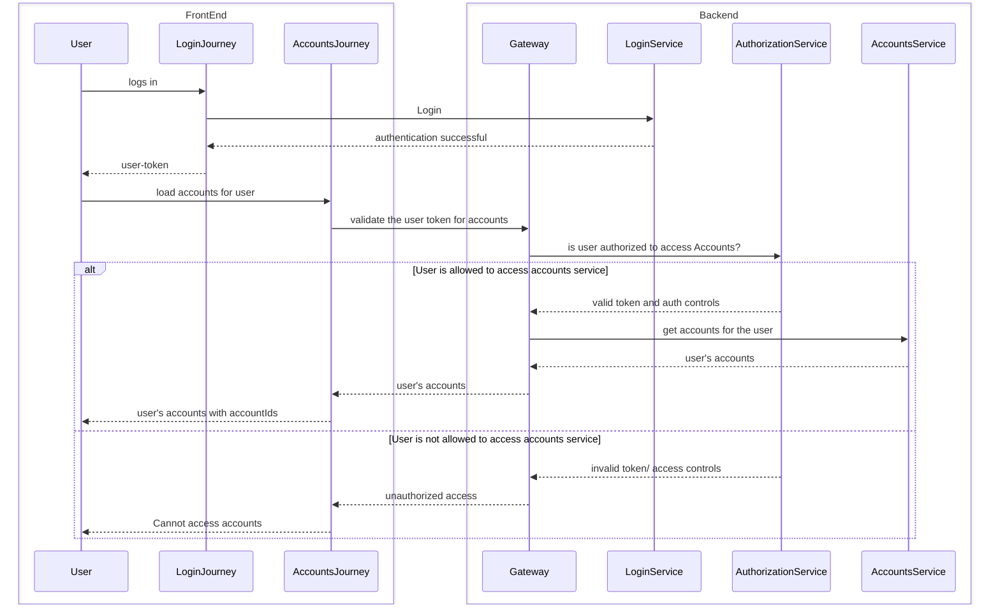
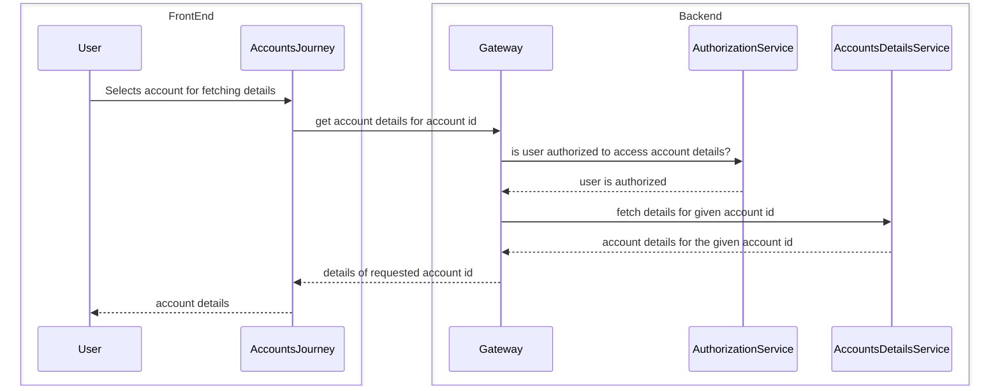
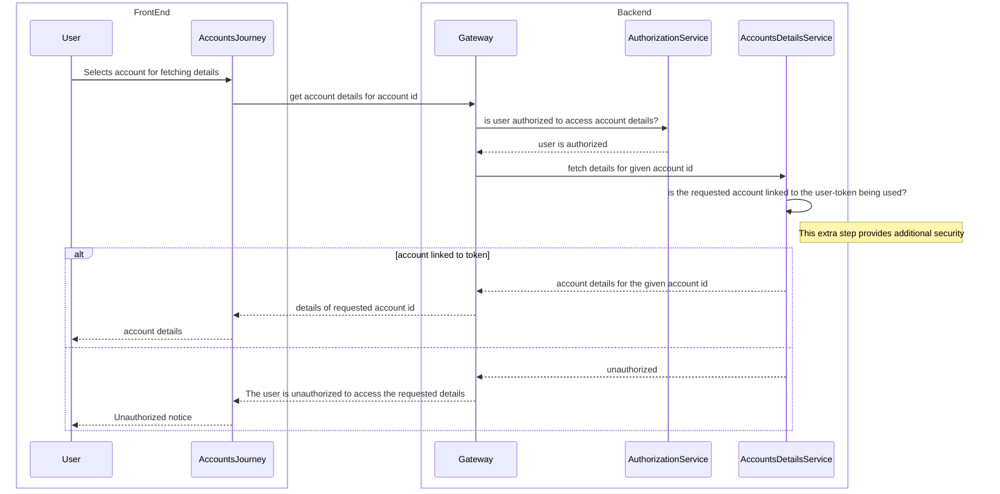

# Access Control in OWASP top 10
Access control is a crucial aspect of application security that ensures users can only perform actions within their authorized permissions. However, broken access control vulnerabilities can lead to unauthorized access, data breaches, and other security risks. In this blog, I want to talk about a very common observation that I have while reviewing codes. Well, not only observed by me, broken access control is the number one in [OWASP Top 10 2021 list](https://owasp.org/Top10/A01_2021-Broken_Access_Control/).

I was reviewing code for a project written by a young developer, and most of the APIs that were written were in the following manner.

## Typical Listing Screen and behaviour

The sequence diagram depicts a user logging into the system and attempting to access their accounts. Initially, the user logs in through the frontend, triggering a login process handled by the login service, which upon successful authentication, issues a user token. The user then requests to load their accounts, prompting the system to validate the user token via the gateway and authorization service. If authorized, the gateway forwards the request to the accounts service, retrieving the user's accounts, which are then returned to the user. Conversely, if unauthorized, the gateway communicates this to the accounts journey, resulting in the user being notified of the inability to access their accounts. This process ensures secure access to user accounts by verifying authentication and authorization at various stages.

This sequence looks fine and secure. We have sufficient controls in place, we are authenticating the user, and also checking if the logged in user has right roles to access the accounts service. So we have covered both authentication and authorization correctly.

## Typical details screen and behaviour
Now, the user has the list of accounts, s/he select one of the linked accounts to view the account details and transactions.

This sequence diagram outlines the process of a user selecting an account and fetching its details within the system. Initially, the user interacts with the frontend, to select an account for which they want to retrieve details. Subsequently, the accounts journey sends a request to the backend via the gateway to obtain the details corresponding to the selected account ID. The gateway then queries the authorization service to verify whether the user is authorized to access the requested account details. Upon receiving confirmation of user authorization, the gateway proceeds to fetch the account details from the accounts details service. Once the account details are retrieved, they are sent back through the gateway to the accounts journey, which then forwards the details to the user. This sequence ensures that only authorized users can access account details, maintaining security and control within the system.

In this system, we have all mechanisms of security in place. Authentication, authorization, token expiry and rest of the stuff as well. So the sequence looks secure, and generally is approved by senior managers and architects.
## The loophole
However, this approach has a very big flaw. If you have ever accessed REST APIs via a client, you are aware how easy it is to change the inputs to request body of a REST api.

In browsers, you can easily open developer tools and then identify the APIs. For mobile applications too, you have easy network monitoring tools that allow you to identify the requests and responses going over the network.
You can even modify these requests easily. If we have a user, who has valid credentials, but has malicious intents can tweek the requested account ids.

Since in the given sequence, there is no way to identify if the requested account id is linked to the given user, the system will respond with account details, even if the account is not linked to the user.

## The solution
A better approach to solve this problem is to make sure each service validates the authorization of the requested data. Sure, it is a bit of extra effort for microservice developers, but without this we will be developing insecure systems.
For instance the above design should be replaced with something as below :

This sequence diagram depicts a user selecting an account and attempting to retrieve its details, with an additional step included to verify if the requested account is linked to the user token being used. After the user selects an account, the system checks authorization via the gateway and authorization service. Upon authorization confirmation, **the system proceeds to verify if the requested account is associated with the user token**. If the account is linked, its details are fetched and returned to the user; however, if it's not linked, indicating unauthorized access, the system notifies the user accordingly.

 This extra step ensures an additional layer of security by verifying the association between the requested account and the user's token before granting access to sensitive account details.

 Have you came across any such problem in access control mechanisms? Please share your comments below!