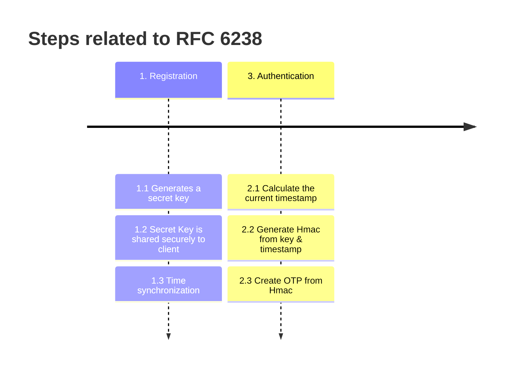
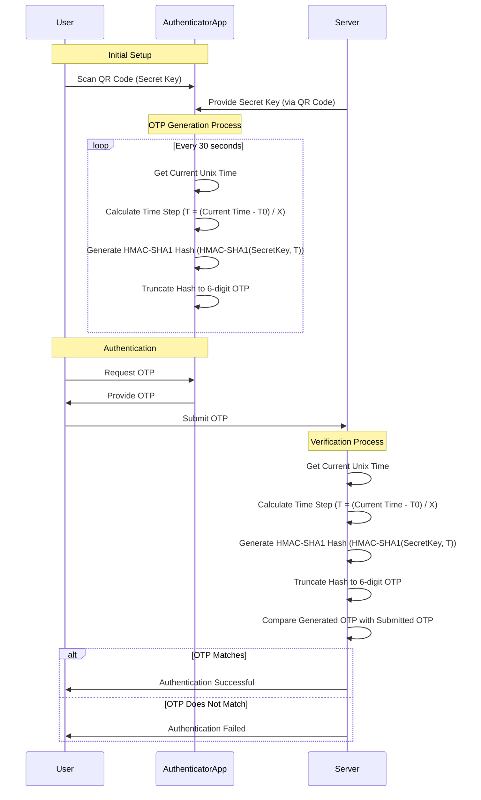

While using any corporate application that is secured by Two Factor Authentication (TFA), we get an option to scan a QR code via an authenticator app. And then after, the number generated by the authenticator app works in login with the given service. Interesting thing is that it doesn't even need internet or any active connection between the authenticator and the server for the authentication to take place.
Have you ever wondered how the two factor authenticators e.g. Google Authenticator or Microsoft Authenticator work?

This magic is possible because of Internet Engineering Task Force (IETF)'s RFC 6238.

RFC 6238 defines the Time-based One-Time Password (TOTP) algorithm, which is widely used for two-factor authentication (2FA). TOTP is an extension of the HMAC-based One-Time Password (HOTP) algorithm, which is defined in RFC 4226. TOTP adds a time component to the OTP generation process, ensuring that the generated passwords are valid only for a short period.

## Key Concepts of RFC 6238:

### Time-based OTP (TOTP)  
TOTP generates a one-time password that is valid for a specific time period. This time period is typically 30 seconds but can be configured.

### Components 

**Shared Secret**: A secret key shared between the client (e.g., Google Authenticator app) and the server.  

**Current Time**: The current Unix time (number of seconds since January 1, 1970) is used in the OTP generation process.

**Time Step**: The time period for which the OTP is valid, usually 30 seconds.

### Algorithm


RFC 6238 outlines the process for generating a time-based one-time password (TOTP) for secure authentication. This process is divided into two main phases: Registration and Authentication. Here’s a detailed explanation of each step involved:

#### Registration Phase
##### Generate a Secret Key:

The server generates a unique secret key for each user. This key is crucial as it will be used to generate the time-based one-time passwords (TOTPs).

##### Share the Secret Key Securely with the Client:

The generated secret key is shared with the client in a secure manner. This can be done through various secure channels such as QR codes, encrypted emails, or secure in-app communication. Ensuring the secrecy of this key is paramount to the security of the TOTP system. The security key, if not used within a short span of time, is expired.

##### Time Synchronization:

Time synchronization between the server and the client is established. Both the server and the client need to have synchronized clocks to ensure that the time-based calculations are accurate. This can be achieved by asking an OTP from the client, and validating the timestep at the server side. If the system is able to authenticate, then the client and server are assumed to be in synch, otherwise not.

#### Authentication Phase
##### Calculate the Current Timestamp:

During authentication, the current timestamp is calculated. This timestamp is usually represented in seconds since a fixed epoch (e.g., Unix epoch starting from January 1, 1970).

##### Generate HMAC from Key and Timestamp:

The secret key and the calculated timestamp are used to generate an HMAC (Hash-based Message Authentication Code). The HMAC is a cryptographic hash function that combines the secret key and the timestamp to produce a unique hash value.

##### Create OTP from HMAC:

The HMAC is then truncated and converted into a numeric code, which forms the TOTP. This code is typically a 6 to 8 digit number that changes every 30 seconds (or another predefined time interval).
The generated TOTP is then used for secure login or transaction verification. Since the TOTP is time-based and changes frequently, it provides an additional layer of security by ensuring that even if a code is intercepted, it becomes invalid after a short period.


### Example Code:
Here is an example of the TOTP algorithm based on RFC 6238:


```java
import javax.crypto.Mac;
import javax.crypto.spec.SecretKeySpec;
import java.nio.ByteBuffer;
import java.nio.charset.StandardCharsets;
import java.util.Base64;

public class TOTPGenerator {

    public static String generateTOTP(String secret, int timeStepInSeconds) {
        try {
            // Decode the base32 secret
            byte[] key = Base64.getDecoder().decode(secret);

            // Get the current Unix time
            long currentTime = System.currentTimeMillis() / 1000L;
            long timeStep = currentTime / timeStepInSeconds;

            // Convert time step to byte array
            ByteBuffer buffer = ByteBuffer.allocate(8);
            buffer.putLong(timeStep);
            byte[] timeStepBytes = buffer.array();

            // Generate HMAC-SHA1 hash
            Mac mac = Mac.getInstance("HmacSHA1");
            SecretKeySpec keySpec = new SecretKeySpec(key, "HmacSHA1");
            mac.init(keySpec);
            byte[] hmacHash = mac.doFinal(timeStepBytes);

            // Truncate the hash to get a 6-digit OTP
            int offset = hmacHash[hmacHash.length - 1] & 0x0F;
            int truncatedHash = ((hmacHash[offset] & 0x7F) << 24) |
                                ((hmacHash[offset + 1] & 0xFF) << 16) |
                                ((hmacHash[offset + 2] & 0xFF) << 8) |
                                (hmacHash[offset + 3] & 0xFF);
            int otp = truncatedHash % 1000000;

            // Format OTP as a 6-digit string
            return String.format("%06d", otp);
        } catch (Exception e) {
            throw new RuntimeException("Error generating TOTP", e);
        }
    }

    public static void main(String[] args) {
        String secret = "JBSWY3DPEHPK3PXP"; // Example base32-encoded secret key
        int timeStepInSeconds = 30; // Time step in seconds

        String otp = generateTOTP(secret, timeStepInSeconds);
        System.out.println("Your OTP is: " + otp);
    }
}
```


### Security Considerations:

**Shared Secret Protection**:
 The shared secret must be securely stored and transmitted.  
**Time Synchronization**:
 Both the client and server must have synchronized clocks to ensure the OTPs match.  
**Short Validity Period**:
 The short validity period of the OTPs (e.g., 30 seconds) limits the window of opportunity for attackers to use a captured OTP.  

## The sequence diagram
Below is a sequence diagram to understand the process.

