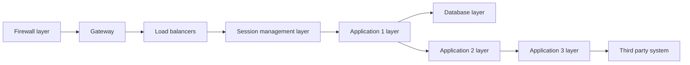
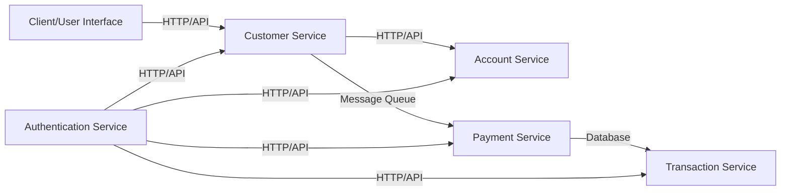
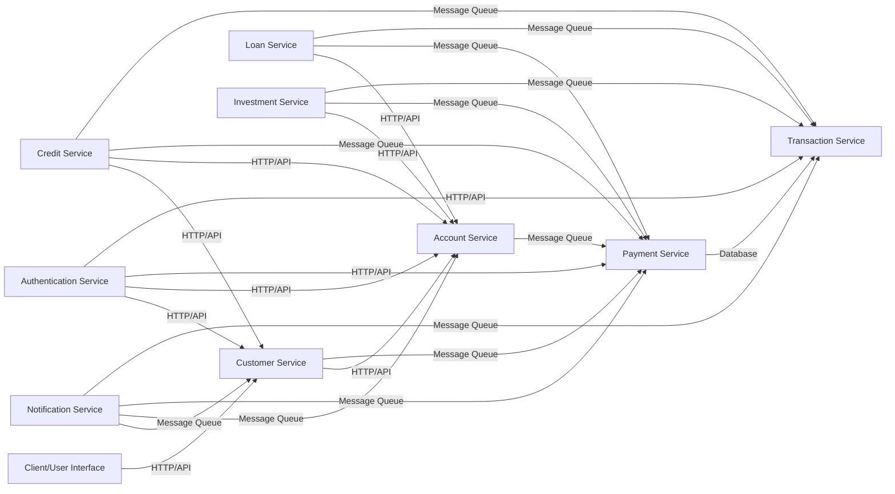
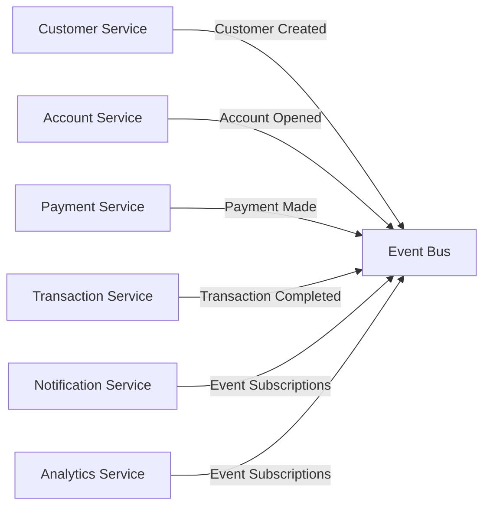

The architecture of a building plays a critical role in its usability and longevity. Similarly, the architecture of a software application is vital for ensuring scalability, maintainability, and overall system success. 
In this blog, we will delve into different architectural approaches that can be employed to achieve these goals: 

1. Layering
2. Microservices
3. Event driven architecture
4. Domain driven design

## Layering: Defining Clear Responsibilities
Layering is a fundamental architectural concept that involves segregating responsibilities into different layers. By creating distinct layers, we can clearly define the responsibilities of each layer, improving security and protecting downstream layers from potential attacks.

In the context of network architecture, layering plays a crucial role in ensuring the secure and efficient flow of data. Let's consider an example where layering is applied to a network infrastructure:

In this diagram, we have different layers that handle specific tasks within the network infrastructure. The Firewall layer acts as the first line of defense, protecting the network from unauthorized access. The Gateway layer manages the entry and exit points of the network, ensuring secure and controlled communication. The Load balancers layer distributes incoming network traffic across multiple servers, enhancing performance and reliability. The Session management layer handles user sessions and authentication, ensuring secure and seamless user experiences. The Application layer contains the core business logic and functionality of the system. Finally, the Database layer stores and manages the data required by the application.

However, it's important to strike a balance when implementing layering. While layering provides clear separation of responsibilities, an excessive number of layers can introduce performance issues and integration complexities.

In this extended diagram, we see an example where the Application layer is further divided into multiple sub-layers, each responsible for different applications or integrations. While this level of granularity can provide enhanced modularity and flexibility, it's essential to carefully consider the trade-offs. Adding more layers can increase complexity, maintenance efforts, and potential points of failure.

By thoughtfully designing and implementing layering in a network or software system, we can achieve clear separation of responsibilities, improved security, and better scalability. It's crucial to strike the right balance and consider the specific needs and constraints of the system to ensure optimal performance and maintainability.

## Microservices Architecture: Scalability and Challenges

Microservices architecture has gained significant popularity due to its ability to provide a scalable and flexible solution for modern software systems. It offers a way to break down complex applications into smaller, independent services that can be developed, deployed, and scaled independently. This architectural approach promotes component-level independence and technology diversity, allowing teams to work on different services simultaneously without being tightly coupled to a monolithic system.

The benefits of microservices architecture are evident in its ability to scale individual services based on demand, enabling organizations to handle varying workloads efficiently. This scalability allows teams to allocate resources to specific services without affecting the entire system. Moreover, microservices architecture promotes technology independence, allowing teams to choose the most suitable technology stack for each service, based on its specific requirements.

However, managing multiple microservices and their versions can become challenging, leading to what is commonly referred to as "microservice hell." With numerous services to handle, organizations may face difficulties in monitoring, deployment, and ensuring consistent behavior across services. Proper governance and management practices are crucial to mitigate these challenges.

To address the complexities of managing microservices, organizations can implement effective governance strategies. This includes establishing clear guidelines for service design, communication protocols, and versioning practices. Additionally, adopting robust monitoring and observability tools can help track the performance and behavior of individual services, ensuring their reliability and availability.

Service orchestration and coordination become critical in a microservices environment. Implementing service discovery mechanisms, load balancing strategies, and fault tolerance techniques can help manage the interaction and coordination between services effectively. Employing containerization technologies like Docker and container orchestration platforms like Kubernetes can simplify deployment and management of microservices.

In conclusion, microservices architecture offers a scalable and flexible solution for modern software systems. It allows organizations to develop and scale services independently, providing technology independence and agility. However, managing multiple microservices and their versions can pose challenges. By implementing proper governance, adopting effective management practices, and leveraging orchestration and monitoring tools, organizations can successfully navigate the complexities of microservices architecture and harness its benefits.

## Event-Driven Architecture: Achieving Loose Coupling and Asynchronous Processing

Event-Driven Architecture (EDA) is an architectural style that promotes loose coupling and asynchronous processing in software systems. It offers a way to design systems where components communicate and interact primarily through events. This approach provides several benefits, including improved perceived performance, scalability, and flexibility.

One of the key advantages of EDA is its ability to achieve loose coupling between components. In traditional architectures, components are tightly coupled, meaning they have direct dependencies on each other. In contrast, EDA allows components to communicate indirectly through events. This loose coupling enables greater flexibility, as components can evolve independently without affecting the entire system. It also promotes reusability, as components can be easily replaced or added without disrupting the existing system.

Asynchronous processing is another significant advantage of EDA. By using events, components can operate independently and asynchronously. When an event occurs, it is published to a message broker or event bus, and interested components can subscribe to these events. This decoupled nature allows components to process events at their own pace, improving responsiveness and scalability. As a result, EDA is well-suited for systems that require real-time or near-real-time processing.

EDA is commonly used for logging and auditing purposes. Events can be generated and published to capture important system activities, such as user actions or system events. These events can then be consumed by logging or auditing services, ensuring a comprehensive record of system activities. By using events for logging and auditing, system performance is not compromised, as these activities can be performed asynchronously without impacting the main processing flow.

However, it's important to consider the potential downsides of event-driven architecture. When an excessive number of events are used, it can become challenging to understand the flow of control within the system. The asynchronous nature of event processing can make it difficult to trace the sequence of events and the resulting system behavior. Therefore, careful consideration should be given to strike the right balance and avoid excessive complexity in event-driven systems.

In conclusion, event-driven architecture offers several advantages, including loose coupling, asynchronous processing, and improved perceived performance. It enables systems to scale, evolve, and handle real-time processing efficiently. However, it's crucial to carefully design and manage the flow of events to maintain clarity and avoid excessive complexity. By leveraging the benefits of event-driven architecture while considering its limitations, organizations can build flexible and scalable systems that meet their business needs.

## Domain-Driven Design (DDD): Simplifying System Components and Enabling Vendor Flexibility

Domain-Driven Design (DDD) is an approach that focuses on aligning software systems with the business domain they are built for. It aims to create a shared understanding and language between domain experts and software developers, resulting in systems that are more maintainable, extensible, and closely aligned with business requirements.

One of the key benefits of DDD is that it helps in keeping the system components' names easy to understand. By placing emphasis on the core business domain, DDD encourages the use of domain-specific terminology and concepts in naming system components. This approach makes the codebase more readable and easier to comprehend for both developers and domain experts. Clear and meaningful naming conventions improve collaboration, reduce ambiguity, and enhance the overall quality of the software system.

Furthermore, DDD emphasizes the importance of creating a vocabulary that reflects the business requirements. By establishing a ubiquitous language, DDD ensures that all stakeholders, including developers, domain experts, and users, have a shared understanding of the system's functionality and behavior. This common language helps bridge the communication gap between technical and non-technical team members, facilitating more effective collaboration and reducing the risk of misunderstandings.

Another advantage of DDD is its ability to facilitate vendor flexibility. By creating well-defined boundaries and abstractions within the system, DDD enables the replacement of vendors or external services with minimal impact on the core domain. The domain model acts as a shield, encapsulating the complexities of external dependencies and providing a stable interface for interaction. This abstraction layer allows for easier integration of new vendors or services, reducing the coupling between the system and external dependencies.

DDD also promotes the creation of abstractions in the layers of the system. By identifying and separating the core domain from infrastructure concerns, such as persistence or user interface, DDD allows for better maintainability and testability. The use of domain-specific abstractions helps in isolating and managing complexities, making the system more adaptable to changes and reducing the risk of technical debt.

DDD is beautifully explained in this stackoverflow answer https://stackoverflow.com/questions/1222392/what-is-domain-driven-design-ddd/1222488#1222488

In summary, how we design software is super important for how well it works and how long it lasts. We talked about a few ways to design software: splitting responsibilities into layers, using smaller independent services (like building blocks) called microservices, making systems that react to events, and designing software that matches the real world (domain-driven design). Each way has its own good parts and challenges. It's like choosing tools for a job – you need to pick the right one for the task. Understanding these ways of designing software helps us make systems that can change and grow along with the needs of users and businesses. So, it's all about making smart choices, managing things well, and always improving to keep our software strong, flexible, and useful for the long haul.

Feel free to leave your comments, questions, or suggestions—I would love to hear from you! Let's continue the conversation and explore the exciting world of software architecture together. Happy reading!