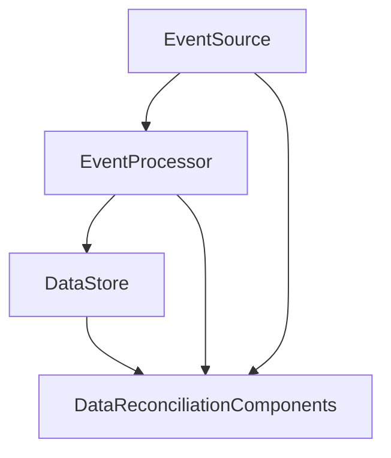

I recently attended an XKE (Xebia's Knowledge Exchange) session delivered by Mr. Chandan Kumar and Mr. Himanshu Jain.
In this session they talked about the Data Reconciliation Patterns in an Event driven AWS Ecosystem, and I am presenting here my learnings from the session.

Data reconciliation is vital to ensure that data across different systems or components remains consistent and in sync. In the realm of application development, multiple systems work together to deliver specific functionalities. However, due to the complexity involved, system failures mid-transaction can lead to data inconsistencies. As vigilant system architects, it is crucial to design robust systems capable of recovering from such data irregularities. Data reconciliation plays a key role in rectifying data inconsistencies, automating error resolutions, and allowing for manual interventions when needed.

Event-driven architecture in AWS involves using services like Amazon S3, Amazon Kinesis, AWS Lambda, Amazon SQS, and Amazon SNS to build scalable and resilient applications that respond to events in real-time.

The most errors related to data reconciliation happens when the data flows from one system to another. To prevent data loss it is important to capture the information before being sent over the network.

# TL;DR
1. Event Sourcing
    - **Concept**: Treats system changes as individual events or actions.
    - **Process**: Records every event that alters the system's state.
    - **Function**: Allows the system to be reconstructed accurately by replaying the recorded events in sequence.
2. Change Data Capture
    - **Concept**: Involves capturing and tracking changes made to data in a source system.
    - **Process**: Captures data changes and creates a chronological chain of events.
    - **Function**: Enables the recreation of the system by leveraging the captured changes in the correct sequence.
3. Idempotent Consumers
    - **Principle**: Ensures that repeating the same request multiple times has the same effect as doing it just once.
    - **Process**: Handles requests in a way that duplicates do not cause additional changes.
    - **Function**: Guarantees that processing the same request multiple times does not lead to duplicate or incorrect outcomes.
4. Compensation Events
    - **Concept**: Designed to handle failures by reverting or correcting changes made by previous events.
    - **Process**: Rollback events to rectify errors or failures that occur during data processing.
    - **Function**: Manages transaction failures by undoing or compensating for incorrect data changes, ensuring data integrity and consistency.

## Event Sourcing

Event sourcing stands out as a robust pattern in the realm of data reconciliation, offering a structured approach to capturing state changes within an application. By recording every alteration to the application's state as a series of events, event sourcing provides a comprehensive and chronological log of all transactions and updates.

### Key Benefits of Event Sourcing:
 - **Reliable Log of State Changes**
 - **Replayability for Accurate State Reconstruction**
 - **Facilitation of Data Consistency**
 - **Enhanced Auditing and Traceability**

## Change Data Capture
Change Data Capture (CDC) plays a pivotal role in maintaining data consistency and integrity by capturing and propagating changes made to data in a source database to other systems in real-time. This process enables organizations to synchronize data updates seamlessly across multiple systems, ensuring that all systems have access to the most up-to-date information.

### Key Aspects of Change Data Capture:
- **Real-Time Data Propagation**
- **Minimized Data Latency**
- **Efficient Data Integration**
- **AWS DMS for Change Data Capture**

## Idempotent Consumers
Idempotent consumers play a crucial role in data processing workflows by ensuring that processing the same event multiple times does not result in duplicate or incorrect data. This concept is particularly important in distributed systems where events may be processed multiple times due to network issues, system failures, or retries, potentially leading to data inconsistencies if not handled correctly.

### Key Features of Idempotent Consumers
- **Data Consistency**
- **Error Handling**
- **Scalability**
- **Data Reconciliation**

## Compensation Events

Compensation events serve as a critical mechanism in event-driven systems to address failures and inconsistencies that may arise during data processing. These events are designed to revert or correct the changes made by preceding events, ensuring data integrity and consistency even in the face of unexpected errors or disruptions.

### Key Aspects of Compensation Events:
- **Error Handling**
- **Data Reversal**
- **Data Correction**
- **Transaction Rollback**

### Benefits of Compensation Events:
**Data Integrity Assurance**: Compensation events safeguard data integrity by providing a mechanism to rectify errors and inconsistencies in data processing workflows.

**Fault Tolerance**: By enabling systems to recover from failures and errors, compensation events enhance the fault tolerance of event-driven architectures and ensure the reliability of data processing operations.

**Consistency Maintenance**: Compensation events help maintain data consistency across systems by addressing discrepancies and ensuring that data remains accurate and up to date.
