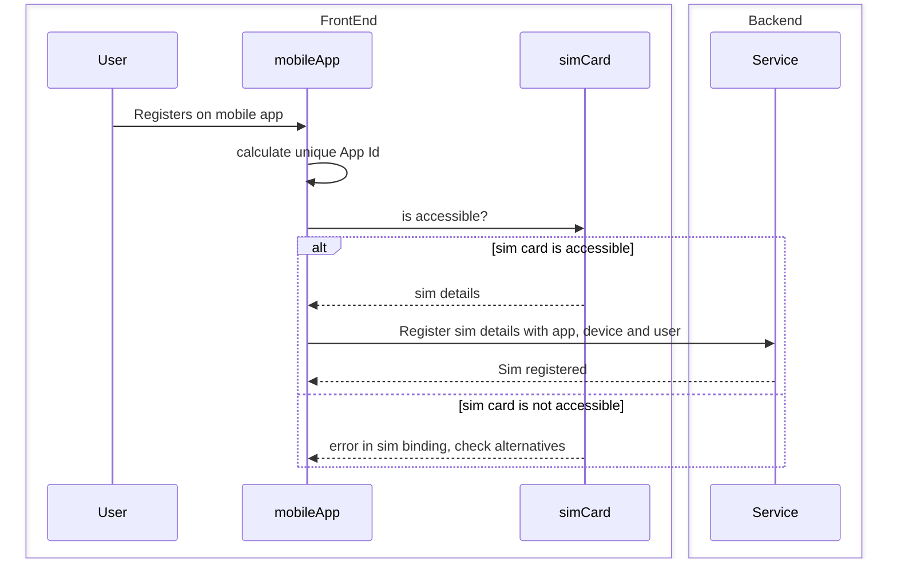
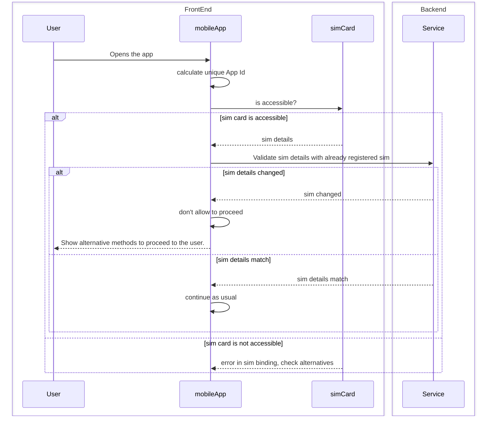
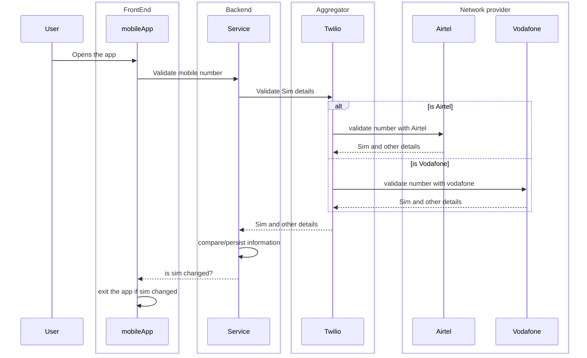
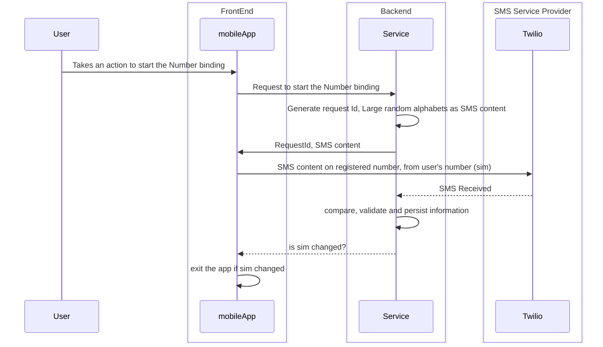

# Sim Binding
Sim binding is a process requirement by RBI to provide secure mobile applications. The RBI has issued the Master Direction on Digital Payment Security Controls to ensure the security of digital payment systems. The directions apply to scheduled commercial banks, small finance banks, payments banks, and credit card issuing NBFCs. The guidelines emphasize the need for a robust governance structure and implementation of security controls for digital payment products and services.

> 33. In view of the proliferation of cyber-attacks and their potential consequences, REs should implement, except where explicitly permitted/ relaxed, multi-factor authentication for payments through electronic modes and fund transfers, including cash withdrawals from ATMs/ micro-ATMs/ business correspondents, through digital payment applications. At least one of the authentication methodologies should be generally dynamic or non-replicable. [e.g., Use of One Time Password, mobile devices (device binding and SIM), biometric/ PKI/ hardware tokens, EMV chip card (for Card Present Transactions) with server-side verification could be termed either in dynamic or non-replicable methodologies.].

> — <cite>RBI Master Direction on Digital Payment Security Controls[^1]</cite>

[^1]: [RBI Master Direction on Digital Payment Security Controls](https://www.rbi.org.in/Scripts/NotificationUser.aspx?Id=12032) 

Sim binding involves linking the SIM card to the mobile application to enhance security. The compliance requirements include implementing alternatives to SMS-based OTP authentication mechanisms, re-authentication for unused devices or applications, not storing sensitive information on the device, and securing mobile applications from SQL injection vulnerabilities.

## The compliance requirements
Compliance regulations necessitate linking the application with physical elements that are inherently resistant to change. These physical elements can encompass the mobile device itself, a hard token, or even the SIM card. As a robust security measure, authentication must be based on multiple factors rather than relying solely on a single mechanism. By incorporating multiple factors into the authentication process, it becomes significantly more challenging to counterfeit, thereby reducing the occurrence of fraudulent activities. This multi-factor authentication approach not only bolsters security but also instills greater confidence in the integrity of the system.

## Sim card
A SIM card, or Subscriber Identification Module, is a small chip that is inserted into a mobile device to identify and authenticate the user on a cellular network. It contains unique information, such as the mobile number and network provider, and allows the device to connect to the network and make calls, send messages, and access mobile data. SIM cards are used in mobile phones, tablets, and other devices that require cellular connectivity. They play a crucial role in ensuring secure communication and authentication for mobile applications, including mobile banking and mobile payments.
## Binding sim card
Sim cards store Personally Identifiable Information (PII) and other sensitive data, making it crucial to protect their access. Due to the sensitivity of this information, different device operating systems adopt varying approaches to expose sim card details to app developers. 

**iOS:** Apple's iOS operating system does not provide direct access to sim card details through its APIs. This limitation is implemented to prioritize user privacy and data security. App developers on iOS cannot retrieve sim card information programmatically, ensuring that sensitive data stored on the sim card remains protected.

**Android and Windows:** On the other hand, operating systems like Android and Windows offer some level of access to sim card details through their APIs. This access allows app developers to retrieve certain information from the sim card, such as the International Mobile Subscriber Identity (IMSI) or the Integrated Circuit Card Identifier (ICCID). However, it's important to note that the level of access and the specific details that can be retrieved may vary depending on the specific version of the operating system and the device's hardware capabilities.

By providing limited access to sim card details, Android and Windows enable app developers to leverage this information for certain functionalities while still maintaining a balance between user privacy and app functionality.

#### Sim registration process

##### Understanding the Process: 
The user registration process with SIM card binding involves the interaction between the front-end (user, mobile app, and SIM card) and the back-end (service). Let's break down the steps involved:

**User Registration**: The user initiates the registration process by providing their details through the mobile app.

**Unique App ID Generation**: The mobile app generates a unique App ID for the user. This ID serves as a reference for future interactions and authentication.

**SIM Card Accessibility Check**: The mobile app checks if the SIM card is accessible on the device. This step ensures that the app can communicate with the SIM card for identification purposes.

**SIM Card Details Retrieval**: If the SIM card is accessible, the mobile app retrieves the SIM card details, such as the International Mobile Subscriber Identity (IMSI). These details are essential for binding the SIM card to the user's account.

**SIM Card Registration**: The mobile app sends the SIM card details, along with the App ID and user information, to the back-end service for registration. This step establishes a connection between the user, the mobile app, and the SIM card.

**Registration Confirmation**: The back-end service processes the registration request and confirms the successful binding of the SIM card to the user's account. This confirmation is sent back to the mobile app.

**Error Handling**: In case the SIM card is not accessible or there are errors during the binding process, the mobile app notifies the user and suggests alternative solutions.

#### Sim card validation process

##### Understanding the Process:
 The SIM card validation process involves interactions between the front-end (user, mobile app, and SIM card) and the back-end (service). Let's break down the steps involved:

**User Opens the App**: The user opens the mobile app, initiating the authentication process.

**Unique App ID Calculation**: The mobile app generates a unique App ID for the user, which serves as a reference for future interactions. It must be same through the life of the app, and hence same as the one used during registration process.

**SIM Card Accessibility Check**: The mobile app checks if the SIM card is accessible on the device. This step ensures that the app can communicate with the SIM card for validation purposes.

**SIM Card Details Retrieval**: If the SIM card is accessible, the mobile app retrieves the SIM card details, such as the International Mobile Subscriber Identity (IMSI).

**SIM Card Validation**: The mobile app sends the SIM card details, along with the App ID, to the back-end service for validation. The service compares the received SIM card details with the previously registered SIM card details associated with the user's account.

**Validation Result**: Based on the comparison, the back-end service responds to the mobile app with the validation result.

**Validation Outcome Handling**: If the SIM card details have changed, indicating a potential security breach, the mobile app notifies the user and restricts further access. The user is presented with alternative methods to proceed, such as contacting customer support or initiating account recovery. If the SIM card details match, the mobile app allows the user to continue using the app as usual.

## Alternative Solutions
If sim card details are not directly accessible, there are some alternatives :
1. SNA  - Silent Network Authentication
2. Number based authentication e.g. OTP

#### Silent Network Authentication
For a better user experience, we would like to keep user inputs minimum and would like to perform actions automatically wherever possible.
SNA - Silent Network Authentication is such an alternative for sim binding. 
This process is achieved by getting minimum details from the device e.g. mobile number, and then requesting the network provider to share the additional details. Since the sim card is issued by the network provider, they can validate if the sim is authentic or not.
The complexity here is that there are so many different sim providers, so the programmers will have to integrate with all the different sim providers. Another approach is to integrate with an aggrigator e.g. twilio. that internally integrates with different sim providers and provides the developers with a unified interface.

##### Understanding the Process
 The mobile number and SIM validation process involves interactions between the front-end (user and mobile app), the back-end (service), an aggregator (Twilio), and network providers (Airtel and Vodafone). Let's break down the steps involved:

**User Opens the App**: The user opens the mobile app, initiating the verification process.

**Mobile Number Validation**: The mobile app sends the user's mobile number to the back-end service for validation.

**SIM Validation with Twilio**: The back-end service communicates with Twilio, an aggregator that facilitates communication with network providers.

**Network Provider Validation**: Twilio forwards the mobile number to the appropriate network provider based on the user's network operator (e.g., Airtel or Vodafone).

**SIM and Other Details Retrieval**: The network provider (e.g., Airtel) validates the mobile number and SIM details associated with the user's account. The provider sends this information back to Twilio.

**Information Comparison and Persistence**: The back-end service compares the received SIM and other details with the previously stored information associated with the user's account. If necessary, the service persists the updated information.

**SIM Change Detection**: The back-end service determines if the SIM card has changed by comparing the received SIM details with the stored information. If a change is detected, it indicates a potential security breach.

**App Exit on SIM Change**: If a SIM change is detected, the mobile app prompts the user to exit the app for security reasons. This action helps protect the user's account and sensitive information.

#### OTP based authentication
Sometimes the SNA approach is not feasible due to cost and approval timelines involved. An alternative that is not sim binding, but number binding approach can be used, if the business and compliance agree to it.

In this approach, an OTP is either sent from the service, or from the device to service, and validations are performed on both the ends (mobile and service) to determine if the SMS has been sent from the same device. In this approach, we can determine if a number's sim is present in the device or not. While this is not fraud-proof, it reduces a lot of easily doable frauds, and increases the costs of the hackers.

This approach takes an alternative route for Sim binding, however since an SMS is sent everytime sim (or number) binding is tried this way, the user has to bear the costs for sending the SMS. This might not be a good user experience and hence tricks should be adapted to minimize the cost burden on the users.

Also, since the SMS sending is done over a different channel, the developers need to adapt to techniques like implementing Callback services or polling (or Push notifications) to complete the cycle.

## Considerations
- Virtual Sim cards
With the availability of new types of devices supporting virtual sim cards, there can be a single sim linked with multiple devices. The complexities associated with this needs to be handled.
- Older sim cards
While the operating systems may allow the access to sim details, it is dependent upon the sim itself to provide the details. The older sim cards do not have the capability to provide such an information to the operating systems, and hence even though the OS allows, the sim card becomes the bottleneck for Sim based authentications.

